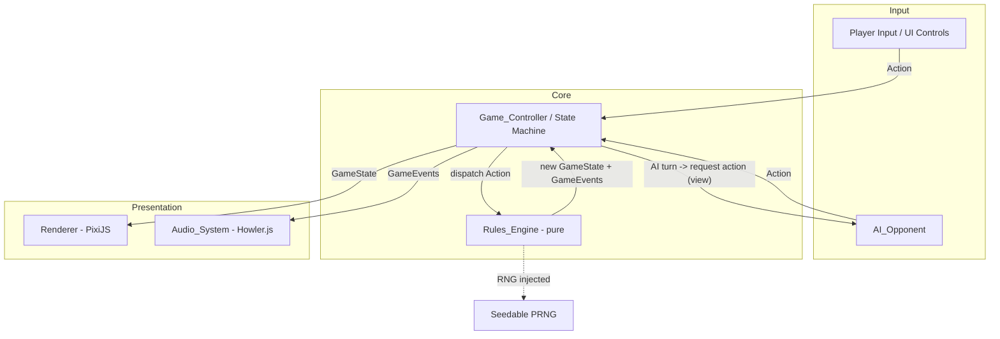
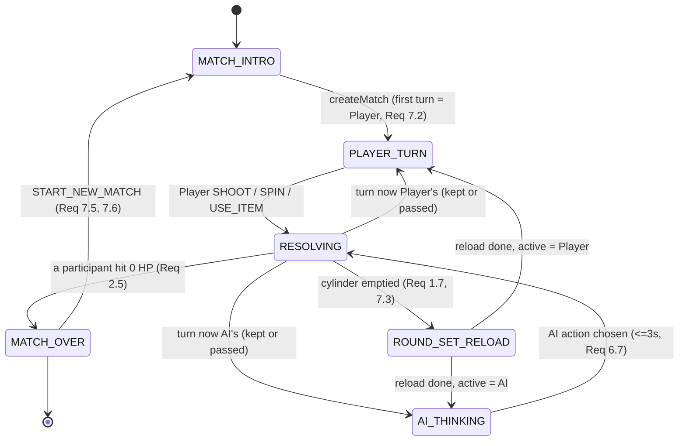
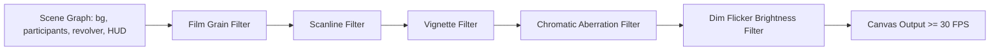

# Design Document

## Overview

Revolver Roulette (single-player prototype milestone) is a web-based, turn-based dueling game. A human Player faces a basic AI_Opponent across a series of Round_Sets, firing a six-chamber revolver at themselves or the opponent until one Participant's HP reaches zero. This design covers the deterministic game logic, the AI decision algorithm, a 2D canvas renderer with retro post-processing, and a web-audio sound system.

The guiding architectural principle is a strict separation between **pure game logic** and **side-effecting presentation**. The `Rules_Engine` is a deterministic, dependency-free module that owns all game state and state transitions. Everything else — the AI, the renderer, the audio system — observes or drives the engine but contains no authoritative game state of its own. This separation makes the rules layer exhaustively unit- and property-testable without a DOM, canvas, or audio context, and keeps the milestone's core question ("is the loop fun?") answerable through fast, reliable tests.

### Goals

- Prove the core gameplay loop with a complete human-vs-AI Match.
- Keep the `Rules_Engine` pure and deterministic so it is property-testable.
- Deliver the grimy retro atmosphere (film grain, scanlines, vignette, chromatic aberration, flickering dim light) called for in the requirements.
- Provide responsive, layered audio with rising tension.

### Non-Goals (per requirements "Out of Scope")

- No multiplayer or networking.
- No real wagering, Solana, or token integration.
- No 3D rendering.
- No accounts, matchmaking, leaderboards, or cross-session persistence.

### Technology Decisions

| Concern | Decision | Rationale |
| --- | --- | --- |
| Language | TypeScript | Static types make the state machine and data models safer; engine is plain TS with no runtime deps. |
| Rendering | 2D canvas via **PixiJS** (WebGL with canvas fallback) | PixiJS gives a render loop, sprite batching, and a filter pipeline ideal for the required post-processing; falls back gracefully and satisfies the "canvas-based" + 30 FPS requirement. |
| Post-processing | PixiJS `Filter` chain (custom GLSL for grain/scanline/vignette/chromatic aberration) | Filters run per-frame on the whole stage, matching Requirement 8.2. |
| Audio | **Howler.js** | Handles sprite-based SFX, looping ambient drone, per-sound volume, and graceful failure (Requirement 9.8). |
| Build/Test | Vite + Vitest + **fast-check** | Vitest for unit tests, fast-check for property-based testing of the `Rules_Engine`. |
| RNG | Injectable PRNG (seedable) | Determinism for tests; the engine never calls `Math.random` directly. |

## Architecture

The application is organized in layers. Game state flows in one direction: an input source (Player UI or AI) produces an **Action**, the `Rules_Engine` reduces it into a new immutable `GameState`, and observers (Renderer, Audio_System) react to the resulting state and emitted `GameEvent`s.



### Layer Responsibilities

- **Rules_Engine (pure):** Owns `GameState`. Exposes pure functions `(state, action, rng) -> { state, events }`. Validates every action; rejects illegal actions without mutating state. Contains no I/O, no timers, no randomness except through the injected PRNG.
- **Game_Controller (state machine):** The only stateful coordinator. Holds the "current" `GameState`, drives the turn/phase state machine, schedules AI turns and timed transitions, and pushes state to the Renderer and events to the Audio_System. Translates raw UI input into validated `Action` objects.
- **AI_Opponent:** A pure decision function `decide(view) -> Action` plus a thin scheduler in the controller that enforces the ≤3s think time (Requirement 6.7). It only sees a **PlayerView** (the public, non-cheating projection of state).
- **Renderer:** Subscribes to `GameState`. Draws the scene at ≥30 FPS and applies the post-processing filter chain every frame. Stateless with respect to game rules.
- **Audio_System:** Subscribes to `GameEvent`s and coarse state (rounds remaining). Plays/loops sounds. Failures are swallowed per Requirement 9.8.

### Why this separation

Requirement-driven: AC sets for Requirements 1–7 describe deterministic rules, and Requirements 8–9 describe presentation. By making the engine pure, the testable rules (Requirements 1–7) are validated independently of PixiJS/Howler, which are validated with example/smoke/integration tests. This also keeps the door open for the future multiplayer milestone (the engine could later run authoritatively on a server) without rework.

## Components and Interfaces

### Rules_Engine

A collection of pure functions operating on immutable `GameState`. The central entry point is a reducer:

```typescript
interface RNG {
  // Returns a float in [0, 1). Seedable implementation used in tests.
  next(): number;
  // Convenience: integer in [0, n).
  nextInt(n: number): number;
}

interface EngineResult {
  state: GameState;
  events: GameEvent[];   // ordered side-effect descriptions for Audio/Renderer
  rejected?: RejectionReason; // present when the action was illegal/no-op
}

// The single authoritative transition function.
function reduce(state: GameState, action: Action, rng: RNG): EngineResult;

// Match/round lifecycle helpers (also pure).
function createMatch(config: GameConfig, rng: RNG): EngineResult;       // Req 7.1, 7.2
function loadRoundSet(state: GameState, rng: RNG): EngineResult;        // Req 1.1-1.5, 7.3
function isMatchOver(state: GameState): boolean;                        // Req 2.5
function winnerOf(state: GameState): ParticipantId | null;             // Req 2.5, 7.4
```

Internal helpers (all pure, all property-testable):

```typescript
function loadCylinder(liveCount: number, blankCount: number, rng: RNG): Cylinder; // Req 1.1, 1.2
function shuffleRemaining(cylinder: Cylinder, rng: RNG): Cylinder;                // Req 4.2
function fire(state: GameState, target: ParticipantId): EngineResult;            // Req 2, 3
function applyItem(state: GameState, item: ItemType): EngineResult;              // Req 5
function remainingCounts(cylinder: Cylinder): { live: number; blank: number };   // Req 1.5
```

### Action Types

Actions are plain data so they can be produced by either the UI or the AI and logged/replayed in tests.

```typescript
type Action =
  | { kind: "SHOOT"; target: ParticipantId }      // Req 3.1, 3.2
  | { kind: "SPIN" }                               // Req 4.1
  | { kind: "USE_ITEM"; item: ItemType }           // Req 5.2
  | { kind: "START_NEW_MATCH" };                  // Req 7.5, 7.6
```

### Game_Controller

```typescript
interface GameController {
  getState(): GameState;
  // Validated input from the human player; ignored unless it is the Player's turn.
  submitPlayerAction(action: Action): void;
  // Registered observers.
  onStateChange(cb: (state: GameState) => void): void;  // Renderer subscribes
  onEvents(cb: (events: GameEvent[]) => void): void;     // Audio subscribes
  // Lifecycle.
  start(config: GameConfig): void;
  dispose(): void;
}
```

The controller runs the state machine (see Game State Machine). When it transitions into `AI_THINKING`, it asks the `AI_Opponent` for an action, applies an artificial delay bounded by 3s, dispatches the action through `reduce`, and continues.

### AI_Opponent

```typescript
// Pure decision over the public view only (cannot see hidden round order).
interface AiOpponent {
  decide(view: PlayerView): Action;  // Req 6.1-6.6
}
```

`PlayerView` deliberately excludes hidden information (the ordered chamber classifications) so the AI cannot cheat. It includes only what Requirement 1.4–1.6 say is visible, plus any knowledge the AI legitimately revealed via its own Magnifying_Glass use.

### Renderer

```typescript
interface Renderer {
  init(canvas: HTMLCanvasElement): Result<void, RenderInitError>; // Req 8.5
  render(state: GameState): void;        // called by controller on state change
  playActionFeedback(event: GameEvent): void; // visual response within 200ms (Req 8.4)
  start(): void;  // begins the ≥30 FPS loop with the filter chain (Req 8.1-8.3)
  stop(): void;
  showRenderUnavailable(): void;          // Req 8.5
}
```

### Audio_System

```typescript
interface AudioSystem {
  init(): void;
  startAmbient(): void;             // Req 9.1 looping drone
  handleEvents(events: GameEvent[]): void; // maps GameEvent -> sound (Req 9.2-9.6)
  setTension(roundsRemaining: number, roundsTotal: number): void; // Req 9.7
  stopAll(): void;
}
```

### GameEvent (engine → presentation)

Events are the engine's declarative description of "what just happened," consumed by Audio and Renderer so they need no rules knowledge:

```typescript
type GameEvent =
  | { type: "ROUND_SET_LOADED"; live: number; blank: number; total: number }
  | { type: "SPUN" }
  | { type: "SHOT_STARTED"; target: ParticipantId }
  | { type: "LIVE_FIRED"; target: ParticipantId; damage: number }
  | { type: "BLANK_FIRED"; target: ParticipantId }
  | { type: "ITEM_USED"; by: ParticipantId; item: ItemType }
  | { type: "TURN_PASSED"; to: ParticipantId }
  | { type: "TURN_SKIPPED"; participant: ParticipantId }
  | { type: "HP_CHANGED"; participant: ParticipantId; hp: number }
  | { type: "MATCH_OVER"; winner: ParticipantId };
```

## Data Models

All state models are immutable; transitions produce new objects. This is essential for deterministic testing and time-travel/replay during debugging.

### Round and Cylinder

```typescript
type RoundType = "LIVE" | "BLANK";

// A chamber holds at most one round; null means fired/emptied.
type Chamber = RoundType | null;

interface Cylinder {
  // Fixed-length array; index 0..size-1. Hidden order (Req 1.6).
  chambers: Chamber[];
  // Index of the Current Chamber (the next round to fire). Req: "Current Chamber".
  currentIndex: number;
  // Original loaded size for this Round_Set (2..6). Req 1.1.
  size: number;
}
```

Notes:
- `remainingCounts(cylinder)` derives visible live/blank counts by scanning non-null chambers from `currentIndex` onward (Req 1.5). These counts are what the UI and AI see.
- Firing sets the current chamber to `null` and advances `currentIndex` to the next non-null chamber (Req 3.3).
- "All chambers fired or emptied" ⇒ no non-null chambers remain ⇒ reload (Req 1.7, 7.3).

### Participant

```typescript
type ParticipantId = "PLAYER" | "AI";

interface Participant {
  id: ParticipantId;
  hp: number;                  // 0..startingHp (Req 2.1, 2.4)
  items: ItemType[];           // length <= 4 (Req 5.1)
  damageMultiplier: 1 | 2;     // Req 5.9, 5.10
  // Private revealed knowledge of the current chamber, valid until next shot/spin.
  // Not part of the public PlayerView for the opponent. Req 5.4.
  revealedCurrentChamber: RoundType | null;
}
```

### Items

```typescript
type ItemType =
  | "MAGNIFYING_GLASS"  // Req 5.4 reveal current chamber to user
  | "SPEED_LOADER"      // Req 5.5 reload as new Round_Set
  | "MEDKIT"            // Req 5.6 +1 HP up to starting value
  | "HANDCUFFS"         // Req 5.7 skip opponent's next turn
  | "INVERTER"          // Req 5.8 flip current chamber Live<->Blank
  | "HOLLOW_POINT";     // Req 5.9 next live round damage x2
```

### Damage_Multiplier

Stored per-Participant as `damageMultiplier` (1 by default, set to 2 by Hollow_Point). Applied on the next Live Round fired by that Participant, then reset to 1 (Req 2.2, 5.9, 5.10).

### Match / Round_Set State and Configuration

```typescript
interface GameConfig {
  startingHp: number;       // 2..6 (Req 2.1)
  minRounds: number;        // >= 2 (Req 1.1)
  maxRounds: number;        // <= 6 (Req 1.1)
  itemsPerRoundSet: number; // 0..4 (Req 5.1)
  maxItems: number;         // 4 (Req 5.1)
  maxSpinsPerTurn: number;  // 1..3 (Req 4.5)
}

type Phase =
  | "MATCH_INTRO"
  | "PLAYER_TURN"
  | "AI_THINKING"
  | "RESOLVING"        // applying a shot/item, emitting events
  | "ROUND_SET_RELOAD"
  | "MATCH_OVER";

interface GameState {
  config: GameConfig;
  phase: Phase;
  cylinder: Cylinder;
  participants: Record<ParticipantId, Participant>;
  activeParticipant: ParticipantId;     // Active_Participant (Req 3)
  spinsUsedThisTurn: number;            // enforce Req 4.5
  // When set, the named participant's next turn is skipped (Handcuffs, Req 5.7).
  skipNextTurnOf: ParticipantId | null;
  winner: ParticipantId | null;         // Req 2.5, 7.4
  roundSetIndex: number;                // for diagnostics / tension reset
}
```

### PlayerView (projection for AI and UI)

```typescript
interface PlayerView {
  phase: Phase;
  self: ParticipantId;
  selfHp: number;
  opponentHp: number;
  selfItems: ItemType[];
  opponentItems: ItemType[];
  // Visible counts only — never the hidden order (Req 1.4-1.6).
  liveRemaining: number;
  blankRemaining: number;
  roundsRemaining: number;
  spinsUsedThisTurn: number;
  maxSpinsPerTurn: number;
  // Only present if THIS participant revealed it (Magnifying_Glass) and it is still valid.
  knownCurrentChamber: RoundType | null;
}
```

## Game State Machine and Turn Flow

The controller drives transitions; the engine enforces legality. Self-blank shots keep the turn (Req 3.4); self-live and any opponent shot pass the turn (Req 3.5, 3.6); spins and item uses keep the turn (Req 4.4, 5.12).



Turn-passing decision (inside `RESOLVING`), accounting for Handcuffs skip:

1. Determine the next active participant from the action result (kept vs passed).
2. If the turn passes and `skipNextTurnOf === nextActive`, clear the flag and pass again to the original participant (the skipped turn is consumed), emitting `TURN_SKIPPED` (Req 5.7).
3. Reset `spinsUsedThisTurn` to 0 whenever the active participant changes.

## AI Decision Algorithm

The AI is a pure function over `PlayerView`. It mirrors Requirement 6 precisely and never inspects hidden state. Decision order (first matching rule wins):

```
decide(view):
  # Precondition: it is the AI's turn and it must act (Req 6.1, 6.2).

  if liveRemaining == 0 and roundsRemaining > 0:
      return SHOOT(PLAYER)                      # Req 6.3 (all blanks -> shoot player; harmless, advances)

  if blankRemaining == 0 and roundsRemaining > 0:
      return SHOOT(PLAYER)                      # Req 6.4 (all live -> shoot player)

  if knownCurrentChamber == BLANK and liveRemaining > 0:
      return SHOOT(AI)                          # Req 6.5 (safe self-shot keeps turn)

  return SHOOT(PLAYER)                          # Req 6.6 (default)
```

Notes on AI scope for this milestone:
- The AI's action set is restricted to `SHOOT` in the baseline rules above, which fully satisfies the explicit Requirement 6 acceptance criteria. The architecture permits richer behavior (using items, spinning) later because `decide` returns a generic `Action`; any such action still passes through engine validation (Req 6.2).
- The controller guarantees the action is legal before dispatch; if the AI ever returned an illegal action, `reduce` would reject it and the controller would fall back to the default `SHOOT(PLAYER)`.
- The ≤3s think-time bound (Req 6.7) is enforced by the controller scheduling the dispatch with a short, bounded delay (e.g., 600–1200 ms) for game feel, never exceeding 3s.

## Visual Direction: 2.5D Paper Diorama (Dark & Deadly)

The confirmed art direction is a **2.5D paper-diorama** look: every object is a flat 2D sprite, but the scene reads as a tilted 3D pop-up book. The mood is dark, grimy, and deadly — cute-game *structure* with horror *lighting and palette*. This direction was prototyped and approved via a static HTML/CSS mockup (`mockup/ui-preview.html`); the production version is built in PixiJS at the renderer tasks. The full guidance lives in the `paper-diorama-ui` skill (`.kiro/skills/paper-diorama-ui/SKILL.md`).

Key elements:

- **Tilted diorama platform** with a visible thick "cardboard" beveled edge — the single strongest cue that sells the 3D pop-up feel. Rendered as a top surface plus a darker extruded front/side face.
- **Billboard actors** — the Dealer (AI) and the Player stand upright off the table surface as flat papercraft cards, never rotating in 3D. A revolver/cylinder sits at center; physical shell tokens on the table show the live/blank counts (count known, order hidden).
- **Drop shadows** beneath every standing object, flat on the table surface, to ground each sprite.
- **Layered depth + parallax** — separate background, diorama, actor, and HUD layers with a subtle camera sway; nearer objects overlap farther ones via base-line (`y`) depth sorting.
- **Thick black outlines + soft cel shading** on sprites for the papercraft/sticker signature.
- **Lighting:** a single harsh overhead spotlight with the dim flicker specified below; near-black desaturated palette with one accent (sickly green, with blood red reserved for danger/HP).
- **Post-processing:** the retro filter chain (grain, scanlines, vignette, chromatic aberration) binds the scene into one grimy image.

**HUD composition:** grimy player/dealer ID cards (portrait, name, HP pips) in the top corners, a bottom-center item belt of slotted cards for the six items, a turn banner, and shoot/spin action controls. This presentation lives entirely in the Renderer layer; the pure `Rules_Engine` never depends on any of it.

**Animation:** GSAP is an optional addition for the juicy action beats (cylinder spin, revolver sliding to the active participant, recoil kick, camera push-in when the gun is aimed, HUD pulse on HP change), with action feedback's first visible frame landing within 200 ms (Req 8.4).

## Rendering Pipeline

PixiJS hosts a single stage rendered every frame. The scene graph holds background, the two participants, the revolver/cylinder, HP and item HUD, and round-count indicators. A post-processing `Filter` chain is attached to the stage root so it applies to every rendered frame (Req 8.2).



- **Film grain / scanlines / vignette / chromatic aberration:** custom GLSL fragment shaders, animated by a `time` uniform updated each frame (Req 8.2).
- **Dim flicker light:** a brightness multiplier ≤ 0.5 with a noise/sine-driven variation whose period is constrained to 100–1000 ms (Req 8.3).
- **Action feedback:** on receiving a `GameEvent`, the renderer triggers a short tween (muzzle flash for `LIVE_FIRED`, recoil for shots, HUD pulse for `HP_CHANGED`) completing its first visible frame within 200 ms (Req 8.4).
- **Frame rate:** target 30+ FPS; PixiJS ticker drives the loop. Filters are GPU shaders, keeping per-frame cost low.
- **Init failure:** if WebGL/canvas context cannot be created, `init` returns an error; the controller stops the render loop and shows a "rendering unavailable" overlay while keeping Match state intact (Req 8.5).

## Audio System

Howler.js manages all sounds. Layers:

- **Ambient drone:** a single looping `Howl` with `loop: true`, started at Match begin; seamless loop point chosen in the asset (Req 9.1).
- **Tension layer:** a separate looping `Howl` whose volume steps up by a fixed increment each time `roundsRemaining` decreases, reaching max at 1 round remaining (Req 9.7). Computed as `volume = min(1, baseStep * (roundsTotal - roundsRemaining + 1))`-style mapping clamped so 1-remaining = max.
- **One-shot SFX** mapped from `GameEvent`s, each started within 100 ms (controller forwards events synchronously):
  - `SPUN` → cylinder spin clicks (Req 9.2)
  - `SHOT_STARTED` → hammer cock (Req 9.3)
  - `LIVE_FIRED` → gunshot, at higher volume than the blank dry click (Req 9.4)
  - `BLANK_FIRED` → dry click (Req 9.5)
  - UI interactions (from the controller's input handler) → UI blip (Req 9.6)
- **Failure isolation:** each `Howl` is created with an `onloaderror`/`onplayerror` handler that logs and suppresses the single sound; gameplay continues (Req 9.8).

## Correctness Properties

*A property is a characteristic or behavior that should hold true across all valid executions of a system — essentially, a formal statement about what the system should do. Properties serve as the bridge between human-readable specifications and machine-verifiable correctness guarantees.*

These properties target the pure `Rules_Engine` (and the pure AI decision function and the pure tension-volume mapping). Rendering and audio playback (Requirements 8.1–8.6, 9.1–9.6, 9.8) are not property-tested — they are validated with smoke and integration tests as described in the Testing Strategy. Each property below is the consolidated result of the prework reflection.

### Property 1: Loading always produces a valid Round_Set

*For any* valid `GameConfig` and any RNG seed, loading a Round_Set (at match start, on reload, on Speed_Loader, or on empty-cylinder reload) SHALL produce a cylinder whose size is in [2, 6], with at least 1 Live Round and at least 1 Blank Round, exactly one Round per Chamber, and whose displayed live/blank counts equal the true composition; an invalid requested composition SHALL never leave partial state and SHALL be replaced by a valid one.

**Validates: Requirements 1.1, 1.3, 1.4, 1.7, 5.5, 7.1, 7.3**

### Property 2: Shuffle preserves composition and is uniform

*For any* cylinder of remaining rounds, shuffling (on load or on Spin) SHALL produce a permutation that preserves the multiset of Live and Blank Rounds, with every possible ordering equally likely; after a Spin the Current Chamber SHALL be the first remaining Round of the new order.

**Validates: Requirements 1.2, 4.2**

### Property 3: PlayerView exposes accurate counts but never the hidden order

*For any* `GameState` and Participant, the projected `PlayerView` SHALL report remaining Live and Blank counts equal to a direct recount of unfired chambers, and SHALL never expose the per-chamber classification or order, except a `knownCurrentChamber` value that is present only when that Participant revealed it via Magnifying_Glass and no Shot or Spin has occurred since.

**Validates: Requirements 1.5, 1.6**

### Property 4: Damage resolution is correct

*For any* `GameState`, firing the Current Chamber SHALL reduce the target's HP by `min(currentHp, 1 * firerMultiplier)` when the Round is Live and leave all HP unchanged when the Round is Blank; HP SHALL never go below zero; a Live Round fired with multiplier greater than 1 SHALL reset the firer's Damage_Multiplier to 1 afterward, while a Blank Round SHALL NOT consume the multiplier.

**Validates: Requirements 2.2, 2.3, 2.4, 3.2, 5.10**

### Property 5: Reaching zero HP ends the Match with the correct winner

*For any* sequence of legal actions that drives a Participant's HP to zero, the engine SHALL transition to `MATCH_OVER` and declare the other Participant the winner.

**Validates: Requirements 2.5**

### Property 6: Firing advances the Current Chamber

*For any* non-empty cylinder, after a Shot Action the just-fired Chamber SHALL be emptied (null) and the Current Chamber SHALL advance to the next loaded Chamber in order, or signal that no loaded Chamber remains.

**Validates: Requirements 3.3**

### Property 7: Shot turn-transition rules hold

*For any* `GameState` and any Shot Action, when the Match does not end as a result: firing a Blank at oneself SHALL retain the Turn with the Active_Participant; firing a Live Round at oneself SHALL pass the Turn to the opponent; and firing any Round at the opponent SHALL pass the Turn to the opponent.

**Validates: Requirements 3.4, 3.5, 3.6**

### Property 8: Shooting an empty cylinder triggers reload without firing

*For any* `GameState` whose cylinder has no loaded Chamber, a Shot Action SHALL be rejected without firing a Round and SHALL trigger a reload producing a valid new Round_Set.

**Validates: Requirements 3.7**

### Property 9: Illegal actions are state-preserving no-ops

*For any* `GameState`, an illegal action — a Shot or other action by the non-active Participant, a Spin when fewer than 2 Rounds remain or the per-Turn Spin limit is reached, or using an Item not in the Participant's inventory — SHALL be rejected, leave the `GameState` unchanged, and retain the Turn with the Active_Participant.

**Validates: Requirements 3.8, 4.6, 5.13**

### Property 10: Spin invalidates revealed knowledge

*For any* `GameState`, after a Spin Action every Participant's revealed knowledge of any remaining Round's position or classification SHALL be cleared.

**Validates: Requirements 4.3**

### Property 11: Spin limit per Turn is enforced

*For any* `GameConfig`, within a single Turn the number of accepted Spin Actions SHALL never exceed `maxSpinsPerTurn` (1–3); the next Spin beyond the limit SHALL be rejected, and the spin counter SHALL reset when the Active_Participant changes.

**Validates: Requirements 4.5**

### Property 12: Non-shot actions retain the Turn

*For any* `GameState`, a successful Spin Action or Item use SHALL leave the Active_Participant unchanged.

**Validates: Requirements 4.4, 5.12**

### Property 13: Item grant respects the inventory cap

*For any* grant count in [0, 4] and any pre-existing inventory, after granting Items the Participant's inventory length SHALL be at most 4, every Item SHALL be one of the six valid Item types, and Items beyond the cap SHALL be discarded.

**Validates: Requirements 5.1**

### Property 14: Using an Item removes exactly that Item

*For any* `GameState` where the Active_Participant holds Item X, using X SHALL reduce the count of X in that Participant's inventory by exactly one and reduce the total inventory size by one.

**Validates: Requirements 5.3**

### Property 15: Magnifying_Glass reveals only to the user

*For any* `GameState` with a loaded Current Chamber, using the Magnifying_Glass SHALL set the using Participant's revealed value equal to the true classification of the Current Chamber, SHALL leave the opponent's view unchanged, and that revealed knowledge SHALL be cleared by the next Shot or Spin Action.

**Validates: Requirements 5.4**

### Property 16: Medkit heals up to the cap

*For any* Participant HP in [0, startingHp], using the Medkit SHALL set HP to `min(hp + 1, startingHp)`.

**Validates: Requirements 5.6**

### Property 17: Handcuffs skips exactly one opponent Turn

*For any* `GameState`, after the Active_Participant uses Handcuffs and the Turn would next pass to the opponent, the opponent's next Turn SHALL be skipped exactly once, after which normal alternation resumes.

**Validates: Requirements 5.7**

### Property 18: Inverter flips the Current Chamber and is an involution

*For any* `GameState` with a loaded Current Chamber, using the Inverter SHALL change that Chamber's Round from Live to Blank or Blank to Live, and using the Inverter twice in succession SHALL leave the Current Chamber's classification unchanged.

**Validates: Requirements 5.8**

### Property 19: Hollow_Point sets the Damage_Multiplier to 2

*For any* `GameState`, using the Hollow_Point SHALL set the using Participant's Damage_Multiplier to 2.

**Validates: Requirements 5.9**

### Property 20: The AI always returns a single legal action

*For any* reachable AI-turn `PlayerView`, the AI's `decide` function SHALL return exactly one Action whose kind is Shot, Spin, or Item use, and that Action SHALL be accepted (not rejected) by the engine for the state that produced the view.

**Validates: Requirements 6.1, 6.2**

### Property 21: AI shoots the Player when all remaining Rounds are Blank

*For any* `PlayerView` where the remaining Live count is zero and Rounds remain, the AI SHALL choose a Shot Action targeting the Player.

**Validates: Requirements 6.3**

### Property 22: AI shoots the Player when all remaining Rounds are Live

*For any* `PlayerView` where the remaining Blank count is zero and Rounds remain, the AI SHALL choose a Shot Action targeting the Player.

**Validates: Requirements 6.4**

### Property 23: AI shoots itself on a known Blank when Live Rounds remain

*For any* `PlayerView` where the AI confirms the Current Chamber is Blank and not all remaining Rounds are Blank, the AI SHALL choose a Shot Action targeting itself.

**Validates: Requirements 6.5**

### Property 24: AI defaults to shooting the Player

*For any* `PlayerView` in which none of the conditions for Properties 21–23 hold, the AI SHALL choose a Shot Action targeting the Player.

**Validates: Requirements 6.6**

### Property 25: Starting a new Match resets all state to initial values

*For any* `MATCH_OVER` `GameState`, the START_NEW_MATCH action SHALL reset both Participants' HP to the configured starting value, reset Item_Inventory per Requirement 5, reset every Damage_Multiplier to 1, load a valid new Cylinder, and assign the first Turn to the Player.

**Validates: Requirements 7.6, 2.1, 7.2**

### Property 26: Tension volume rises monotonically and peaks at one Round remaining

*For any* total Round count and remaining Round count, the tension-layer volume mapping SHALL be non-decreasing as the remaining count decreases, SHALL equal the maximum volume when exactly 1 Round remains, and SHALL stay within [0, 1].

**Validates: Requirements 9.7**

## Error Handling

The engine treats illegal actions as recoverable, state-preserving no-ops rather than exceptions, so the game can never crash from bad input. Presentation-layer failures degrade gracefully without ending the Match.

| Failure | Layer | Handling |
| --- | --- | --- |
| Action submitted out of turn | Rules_Engine | `reduce` returns `rejected` with the original state unchanged; no events emitted (Req 3.8). |
| Spin when < 2 rounds or spin limit reached | Rules_Engine | Rejected no-op, turn retained (Req 4.6). |
| Use of an item not held | Rules_Engine | Rejected no-op, state preserved (Req 5.13). |
| Shot on empty cylinder | Rules_Engine | Rejected; reload triggered automatically; no round fired (Req 3.7). |
| Invalid cylinder composition request | Rules_Engine | Rejected before any partial state; a valid composition is reselected (Req 1.3). |
| AI returns an illegal action (defensive) | Game_Controller | Controller validates via `reduce`; on rejection, falls back to `SHOOT(PLAYER)` (Req 6.2). |
| Canvas/WebGL context cannot initialize | Renderer | `init` returns an error; controller stops the render loop and shows a "rendering unavailable" overlay while keeping `GameState` intact (Req 8.5). |
| Audio asset fails to load or play | Audio_System | Per-`Howl` error handlers suppress the single sound; gameplay continues uninterrupted (Req 9.8). |

General principles:
- The engine never throws on gameplay input; it returns a typed `EngineResult` with an optional `RejectionReason`.
- Invariants (HP ≥ 0, inventory ≤ 4, spins ≤ max, exactly one round per loaded chamber) are enforced at transition time, not merely asserted afterward.
- Presentation failures (render init, audio) are isolated from the rules layer so the authoritative `GameState` survives any I/O fault.

## Testing Strategy

The strategy is dual: **property-based tests** validate universal correctness of the pure layers, and **example / integration / smoke tests** cover concrete scenarios, presentation wiring, and timing requirements that are not amenable to PBT.

### Property-Based Tests (Rules_Engine, AI, tension mapping)

- **Library:** `fast-check` with `vitest`. We do not implement PBT infrastructure from scratch.
- **Determinism:** the engine takes an injected seedable `RNG`; tests pass a seeded generator so failures are reproducible and shrinkable.
- **Iterations:** each property test runs a **minimum of 100 iterations** (`fast-check` `numRuns: 100` or higher).
- **Generators:**
  - `GameConfig` generator over valid ranges (startingHp 2–6, rounds 2–6, items 0–4, maxSpins 1–3).
  - `Cylinder` generator producing valid compositions and partially-fired states.
  - `GameState` generator producing reachable states (via random legal action sequences from `createMatch`) to exercise transitions realistically, plus targeted generators for edge states (1 HP, empty cylinder, full inventory, spin limit reached).
  - `Action` generators for both legal and deliberately illegal actions (to drive Property 9).
- **Tagging:** every property test is tagged with a comment referencing its design property, format:
  `// Feature: revolver-roulette, Property {number}: {property_text}`
- **Coverage:** one property-based test per correctness property (Properties 1–26). Each test references the property it validates.

Example skeleton:

```typescript
import fc from "fast-check";

// Feature: revolver-roulette, Property 4: Damage resolution is correct
test("live round reduces HP by clamped multiplier and resets multiplier", () => {
  fc.assert(
    fc.property(arbFireableState(), (state) => {
      const target = state.activeParticipant === "PLAYER" ? "AI" : "PLAYER";
      const before = state.participants[target].hp;
      const { state: next } = reduce(state, { kind: "SHOOT", target }, seededRng());
      const current = state.cylinder.chambers[state.cylinder.currentIndex];
      if (current === "LIVE") {
        const mult = state.participants[state.activeParticipant].damageMultiplier;
        expect(next.participants[target].hp).toBe(Math.max(0, before - mult));
        expect(next.participants[state.activeParticipant].damageMultiplier).toBe(1);
      } else {
        expect(next.participants[target].hp).toBe(before);
      }
      expect(next.participants[target].hp).toBeGreaterThanOrEqual(0);
    }),
    { numRuns: 200 }
  );
});
```

### Unit / Example Tests

Focused, concrete tests for behavior that is example-shaped rather than universal:

- Player may target self or opponent on their turn (Req 3.1); multiple sequential item uses allowed in a turn (Req 5.2).
- HUD renders both participants' HP and inventories (Req 2.6 display, 5.11).
- Match-over screen presents a "new match" control (Req 7.5).
- Specific edge cases as concrete examples to complement generators: size-2 cylinder with 1 live/1 blank, healing at the HP cap, double Inverter identity, Handcuffs followed by a kept-turn self-blank then turn pass.

Keep example tests lean — the property tests carry the bulk of input coverage.

### Integration Tests

- **Audio mapping (Req 9.2–9.6, 9.8):** with a mocked Howler, assert each `GameEvent` triggers the expected sound, gunshot volume exceeds dry-click volume (Req 9.4), and a forced load/play error is swallowed without interrupting state.
- **Renderer wiring (Req 8.4, 8.5):** assert an action event produces a visible tween promptly; simulate a failed context init and assert the loop stops, the overlay shows, and `GameState` is unchanged.
- **Controller timing (Req 6.7):** assert AI action is dispatched within the bounded delay (≤ 3 s).
- **Tension layer (Req 9.7):** integration check that decreasing rounds raises the tension `Howl` volume monotonically (the underlying mapping is also property-tested by Property 26).

### Smoke Tests

- **Render loop & filters (Req 8.1–8.3):** start the renderer against a test canvas; assert it initializes, sustains ≥ 30 FPS over a short sample, the filter chain contains film grain + scanlines + vignette + chromatic aberration, the brightness uniform is ≤ 0.5, and the flicker period is within 100–1000 ms.
- **Ambient audio (Req 9.1):** assert the ambient `Howl` is configured with `loop: true` and starts at Match begin.

### Why presentation is not property-tested

Requirements 8.1–8.6 and 9.1–9.6/9.8 describe rendering output, GPU filter behavior, audio playback, and timing against external libraries (PixiJS, Howler) and the browser. Their behavior does not vary meaningfully with generated input and is costly to run hundreds of times, so per the decision guide they are covered by smoke and integration tests with a few representative cases. Only the pure, input-driven logic (engine, AI, the tension-volume mapping) is property-tested.
